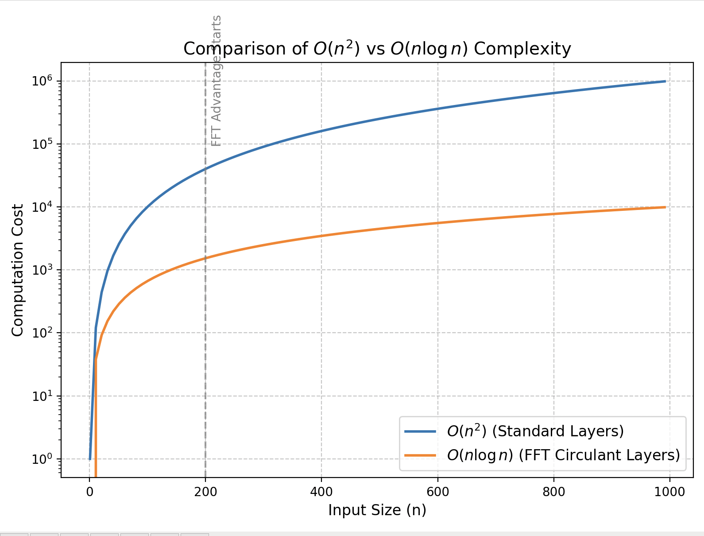

# ChronosForge

ChronosForge is a comprehensive library bridging time-series forecasting, probabilistic modeling, and cutting-edge machine-learning techniques. Inspired by the Greek god of time, **Chronos**, this library symbolizes precision, inevitability, and the exploration of truth through data.

---

## 🌌 Philosophical Inspiration

In Greek mythology, Chronos embodies time and its infinite nature. This library reflects that spirit by crafting tools that transcend time—forecasting the future, analyzing the present, and uncovering the hidden patterns of the past. Whether solving stochastic equations, creating neural transport models, or designing probabilistic machine learning algorithms, **ChronosForge** equips you with the tools to forge solutions in the ever-flowing river of time.

---

## 🚀 Features

ChronosForge includes a variety of modules and algorithms spanning multiple disciplines:

### **Time Forecasting**
- **ARCH**: Analyze volatility and financial time series.
- **LSTM, Transformers**: Deep learning models for sequence prediction.
- **Stochastic Volatility Models**: Predict uncertainty in financial markets.
- **Causal Discovery**: Uncover causal relationships in time-series data.

### **Probabilistic Machine Learning**
- **Gaussian Processes (GP)**: Flexible models for uncertainty quantification.
- **Variational Inference (VI)**: Scalable Bayesian inference techniques.
- **Markov Models (HMM, DMM)**: For sequential data analysis.
- **Monte Carlo Methods**: No U-turn sampler to estimate the posterior distribution


### **Optimization and Theoretical Bounds**
- **Constrained Lagrangian Optimization**: Solve constrained optimization problems.


- **Theoretical Bounds**: Analyze generalization using PAC-Bayes-Bounds and Mutual-Information-Bounds.
#### **PAC-Bayesian Bound**

To evaluate the generalization capabilities of Bayesian Neural Networks (BNNs), we compute the PAC-Bayesian bound:

1. **Empirical Risk**: The average loss across posterior samples:
```math
   \hat{L}(Q) = \frac{1}{N} \sum_{i=1}^{N} \mathbb{E}_{h \sim Q} \left[ \ell(h(x_i), y_i) \right],
```
   where $`\ell`$ is the task-specific loss function, and $`(x_i, y_i)`$ are the data points.

2. **KL Divergence**: Measures the complexity of the posterior \(Q\) relative to the prior \(P\):
```math
\hat{L}(Q) = \frac{1}{N} \sum_{i=1}^{N} \mathbb{E}_{h \sim Q} \left[ \ell(h(x_i), y_i) \right],
```
   where $`\mu_j, \sigma_j`$ are the posterior mean and standard deviation, and $`\mu_{\text{prior}}, \sigma_{\text{prior}}`$ are the prior parameters.

3. **PAC-Bayesian Bound**: Combines empirical risk and complexity:
```math
L(Q) \leq \hat{L}(Q) + \sqrt{\frac{D_{KL}(Q \| P) + \ln(1 / \delta)}{2n}},
```
   where $`L(Q)`$ is the true risk, $`\delta`$ is the confidence level, and $`n`$ is the number of training samples.

#### **Mutual Information Bound**

The mutual information bound quantifies the information gained from the data:

1. **Mutual Information**: Computed as the KL divergence per training sample:
```math
\text{Mutual Information} = \frac{1}{n} D_{KL}(Q \| P),
```
   Providing a measure of model complexity relative to the training data size.

### **Deep Learning Applications**
- **Long Sequence Classification**: Handle document-level tasks with transformers and hierarchical models.
- **Temporal Fusion Transformer (TFT)**: Integrate time-dependent and contextual data.
- **Reinforcement Learning**: Optimize decision-making in dynamic environments.

### **FFT Circulant Applications**
The **FFT Circulant Modules** ChronosForge features comprehensive modules that leverage the properties of circulant matrices and the Fast Fourier Transform (FFT) to enable efficient matrix-vector multiplication, significantly reducing the number of weights in neural networks.
The eigenvectors of a circulant matrix depend only on the size of the matrix, not on the elements of the matrix. Furthermore, these eigenvectors are the columns of the FFT matrix. The eigenvalues depend on the matrix entries, but the eigenvectors do not.
Each element of the FFT matrix represents a complex exponential corresponding to a rotation in the frequency domain. As a result, this technique is highly effective in scenarios where the features exhibit periodicity.


---

### **Bayesian Inference**
Bayesian Neural Networks (BNNs) integrate the power of neural networks with Bayesian principles to model uncertainty effectively. ChronosForge offers a robust set of tools for Bayesian Inference, enabling precise posterior estimation in various applications.

  - **No U-Turn Sampler:** An adaptive Hamiltonian Monte Carlo method for efficient sampling. 
  - **Stochastic Variational Inference:** Scalable inference for high-dimensional data using gradient-based optimization. 

  - **Stein Variational Inference:** Non-parametric inference using particle-based methods to approximate the posterior. 

These methods collectively aim to provide accurate approximations of posterior distributions, supporting probabilistic reasoning and decision-making.


---

## 📊 Visualizing the Power of ChronosForge

### **1. Time-Series Sentiment Analysis**
ChronosForge provides sentiment analysis tools to evaluate market trends. Below is a 3D scatter plot of predicted sentiments for different companies.


---

### **2. Word Clouds for Sentiment Classes**
ChronosForge visualizes sentiment-driven keywords for better interpretability. Here’s a word cloud generated for **Sentiment Class 1**.


---

### **3. Stock Price Forecasting**
ChronosForge's stochastic models can predict stock prices with high accuracy. Below is a comparison of **actual** vs. **predicted** stock prices for Novo Nordisk using ensemble techniques.


We Provide summaries and visualizations to evaluate and interpret model performance effectively.

---

### **4. Brownian Motion, Heston Models and Jump Diffusion**
ChronosForge incorporates advanced stochastic models to simulate and analyze financial markets with greater realism:

#### **Brownian Motion**
Brownian motion forms the backbone of stochastic processes in finance, modeling the random behavior of stock prices:

```math
S(t) = S(0) \exp\left(\left(\mu - \frac{\sigma^2}{2}\right)t + \sigma W(t)\right)
```
Where:
- $`S(t)`$: Stock price at time t
- $`S(0)`$: Initial stock price
- $`\mu`$: Drift term (average return rate)
- $`\sigma`$: Volatility (standard deviation of stock returns)
- $`W(t)`$: Standard Brownian motion


#### **Jump Diffusion**
Jump diffusion adds discrete jumps to Brownian motion, modeling sudden market movements:
```math
S(t) = S(0) \exp\left(\left(\mu - \frac{\sigma^2}{2}\right)t + \sigma W(t) + \sum_{i=1}^{N(t)} J_i\right)
```
Where:
- $`J_i`$ : The jump size of the \( i \)-th jump
- $`N(t)`$: A Poisson process representing the number of jumps up to time $`t`$

> **Visualization**:


---

## 📁 Directory Structure

```
|-BNN
   |---DENSE
   |-----MCMC_METHOD
   |-----STEIN_VI
   |-----SVI_METHOD
   |---FFT
   |-----MCMC_METHOD
   |-----STEIN_VI
   |-----SVI_METHOD
   |-constrained_lagrangian
   |-deep_markov_model
   |-fft_circulant_DMM
   |-gaussian_process
   |-gmm_project
   |-hidden_markov_model
   |-hilbert_space
   |-images
   |-long_seq_classifier
   |-neural_transport
   |-news_data_scraping
   |-ordinary_differential_equations
   |-physics_DMM
   |-predator_prey
   |-similarity_tools
   |-stock_price_forecasting
   |-structural_bioinformatics
   |---data
   |---exercises
   |-theoretical_bounds
   |-time_forecasting
   |-var2_project
```

---

## 🛠️ Installation

```bash
git clone https://github.com/your-username/chronosforge.git
cd chronosforge
pip install -r requirements.txt
```

---

## 🧪 Contributing

We welcome contributions! To get started:

1. Fork this repository.
2. Create a new branch: `git checkout -b feature-name`.
3. Commit your changes: `git commit -m 'Add some feature'`.
4. Push to the branch: `git push origin feature-name`.
5. Submit a pull request.

---

## Licensing Options
This project is licensed under the GPL v3. For proprietary licensing options, contact josephmargaryan@gmail.com.


---

## ❤️ Acknowledgments

Special thanks to the developers and researchers who inspired this project. ChronosForge aims to provide tools for modern research and practical applications in the vast field of machine learning and probabilistic inference.
