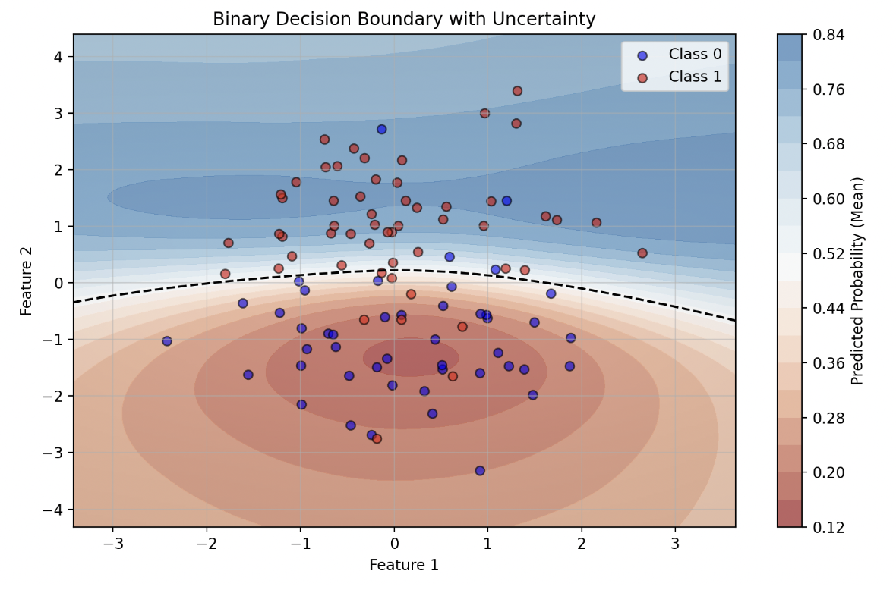
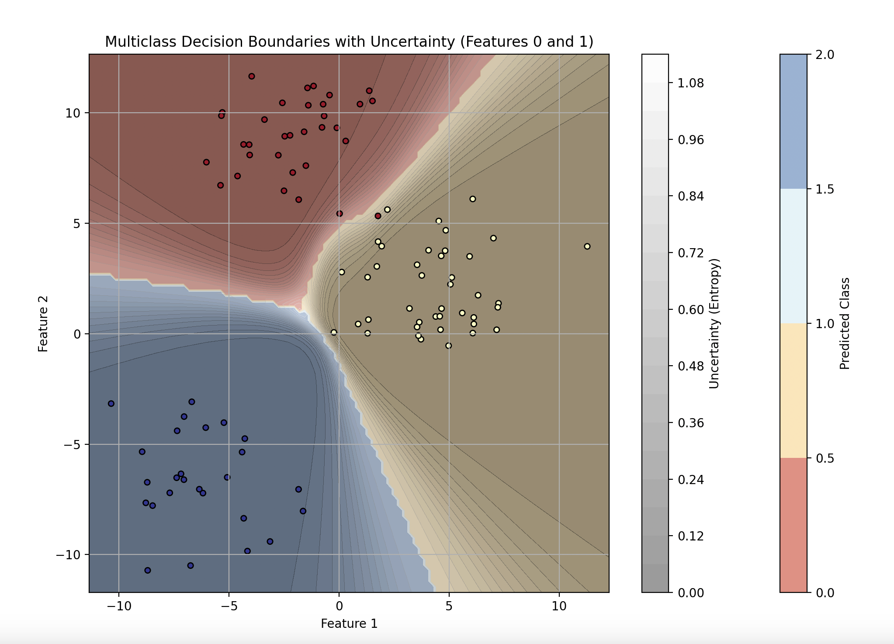
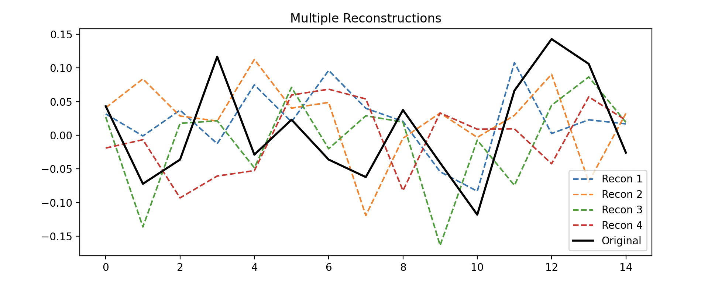
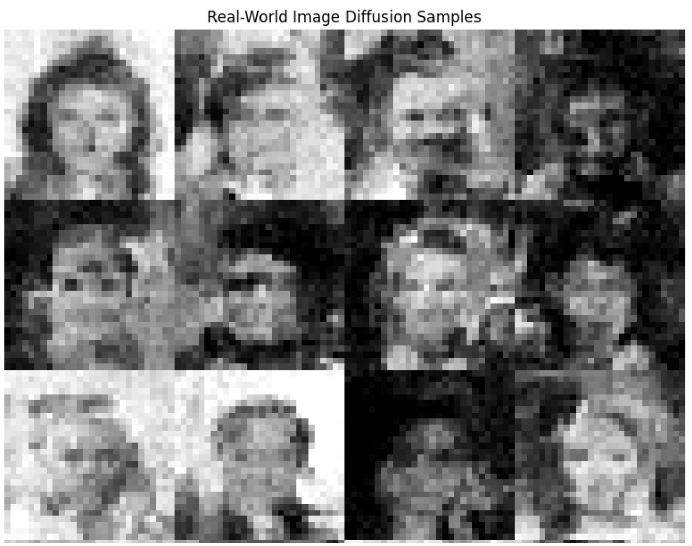
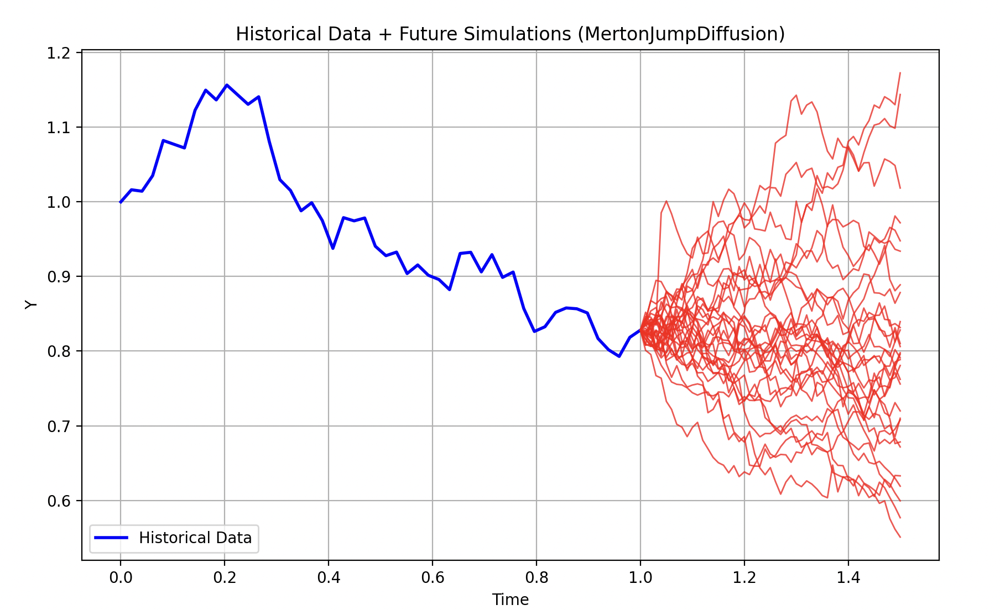

# QuantBayes

QuantBayes is an advanced probabilistic machine learning library integrating **Bayesian inference, stochastic differential equations (SDEs), and deep learning**. It provides utilities for **training deterministic and probabilistic models in PyTorch (`torch.nn`) and JAX (`equinox`)** (by Patrick Kidger et al), supporting classification, regression, segmentation, and generative modeling tasks.

## Features

### **1. Deterministic & Bayesian Learning**
- Unified support for **PyTorch** and **equinox (JAX)** architectures.
- Probabilistic inference with:
  - **NUTS (No-U-Turn Sampler)**
  - **SVI (Stochastic Variational Inference)**
  - **Stein Variational Inference**
- AutoML utilities for:
  - **Binary, Multiclass Classification**
  - **Regression**
  - **Image Classification, Segmentation**

### **2. Stochastic & Probabilistic Models**
- **Stochastic Differential Equations (SDEs)**: 
- **Bayesian Deep Learning**:
- **Diffusion Models**
- **Variational Autoencoders**
- **Deep Markov Models**
- **Energy Based Models**
- **Time Series Forecasting**: Bayesian LSTMs, Transformers, Gaussian Processes.

### **3. Efficient Computation**
- **FFT-based Bayesian Layers** Custom layers for both deterministic neural networks and Bayesian probabilistic sampling
- **Quantitative Finance Applications**: Volatility modeling, probabilistic forecasting.
- **Visualization**: Calibration plots, posterior distributions, uncertainty estimation.

---

## Installation

QuantBayes can be cloned and, in the future,e installed using pip:
`git clone https://github.com/josephmargaryan/quantbayes.git`
## Getting Started
Please see the notebooks in `examples/`

### Example: Using Prebuilt AutoML Models

    from quantbayes.bnn.AutoML import DenseBinaryiSteinVI
    
    # Initialize a prebuilt model for binary classification
    model = DenseBinaryiSteinVI(num_particles=10, 
                    model_type="deep", 
                    hidden_size=3, 
                    num_steps=100
                    )
    
    # Train and predict
    model.fit(X_train, y_train, key)
    preds = model.predict(X_test, key)
    model.visualize(X=X_test, y=y_test, resolution=100, features=(0, 1))

<table>
  <tr>
    <td align="center">
       
      BNN Regression
    </td>
    <td align="center">
       
      Binary Decision Boundary
    </td>
    <td align="center">
       
      Multiclass Decision Boundary
    </td>
  </tr>
</table>

<table>
  <tr>
    <td align="center">
       
      Variational AutoEncoder
    </td>
    <td align="center">
       
      Deep Markov Model Reconstruction
    </td>
    <td align="center">
       
      Deep Markov Model Forecast Predictions
    </td>
  </tr>
</table>

<table>
  <tr>
    <td align="center">
       
      Score-based Diffusion model trained on 1000 steps
    </td>
    <td align="center">
       
      Score-based diffusion model trained on 10000 steps
    </td>
    <td align="center">
       
      Score-based Diffusion model trained on 100000 steps
    </td>
  </tr>
</table>

### Pac Analysis Bound 
To evaluate the generalization capabilities of Bayesian Neural Networks (BNNs), we compute the PAC-Bayesian bound:

  

1. **Empirical Risk**: The average loss across posterior samples:

$$
\hat{L}(Q) = \frac{1}{N} \sum_{i=1}^{N} \mathbb{E}_{h \sim Q} \left[ \ell(h(x_i), y_i) \right],
$$

where $\ell$ is the task-specific loss function, and $(x_i, y_i)$ are the data points.

2. **KL Divergence**: Measures the complexity of the posterior \(Q\) relative to the prior \(P\):

$$
\hat{L}(Q) = \frac{1}{N} \sum_{i=1}^{N} \mathbb{E}_{h \sim Q} \left[ \ell(h(x_i), y_i) \right],
$$

where $\mu_j, \sigma_j$ are the posterior mean and standard deviation, and $\mu_{\text{prior}}, \sigma_{\text{prior}}$ are the prior parameters.

  

3. **PAC-Bayesian Bound**: Combines empirical risk and complexity:

$$
L(Q) \leq \hat{L}(Q) + \sqrt{\frac{D_{KL}(Q \| P) + \ln(1 / \delta)}{2n}}
$$

where $L(Q)$ is the true risk, $\delta$ is the confidence level, and $n$ is the number of training samples.

# Stochastic Differential Equations Module

This module implements several stochastic differential equations (SDE) models — classical and Bayesian variants — and a neural SDE. These models are applicable in fields such as quantitative finance and physics for simulating processes subject to randomness.
<table>
  <tr>
    <td align="center">
       
      SDE
    </td>
    <td align="center">
       
      Stock Price Forecasting
    </td>
  </tr>
</table>

## 1. Geometric Brownian Motion (GBM)

GBM is widely used to model asset prices. Its dynamics are given by:

$$
dX_t = \mu X_t\,dt + \sigma X_t\,dW_t,
$$

where  
- $\mu$ is the drift,  
- $\sigma$ is the volatility, and  
- $dW_t$ represents increments of a Wiener process.

The closed-form solution is:

$$
X_t = X_0 \exp\!\left[\left(\mu - \tfrac{1}{2}\sigma^2\right)t + \sigma W_t\right].
$$

Our implementation estimates parameters via log returns and simulates paths using the Euler-Maruyama scheme.

## 2. Heston Model

The Heston model captures stochastic volatility through two coupled SDEs:

$$
\begin{aligned}
dS_t &= \mu S_t\,dt + \sqrt{v_t}\,S_t\,dW_t^{(1)},\\
dv_t &= \kappa (\theta - v_t)\,dt + \sigma \sqrt{v_t}\,dW_t^{(2)},
\end{aligned}
$$

with  
- $S_t$ as the asset price,  
- $v_t$ as the instantaneous variance,  
- $\kappa$ the rate of mean reversion,  
- $\theta$ the long-term variance, and  
- $\rho$ the correlation between the two Brownian motions $dW_t^{(1)}$ and $dW_t^{(2)}$.

Simulation is performed using a correlated Euler scheme.

## 3. Merton Jump Diffusion

To model sudden price changes (jumps), Merton’s jump-diffusion model augments GBM with a jump component:

$$
dS_t = S_t \left(\mu\,dt + \sigma\,dW_t\right) + S_t (J - 1)\,dN_t,
$$

where  
- $dN_t$ is a Poisson process with intensity $\lambda$, and  
- $J$ (typically log-normally distributed) represents the jump multiplier.

This allows the model to capture both continuous fluctuations and discrete jumps.

## 4. Ornstein-Uhlenbeck Process (OU)

The OU process is a mean-reverting process described by:

$$
dX_t = \theta (\mu - X_t)\,dt + \sigma\,dW_t,
$$

where  
- $\theta$ is the speed of mean reversion,  
- $\mu$ is the long-term mean, and  
- $\sigma$ is the volatility.

We estimate parameters using a method-of-moments approach and simulate using Euler-Maruyama.

## 5. Bayesian Variants

For GBM, Heston, Merton Jump Diffusion, and OU, Bayesian versions are provided. In these models, parameters (e.g., $\mu$, $\sigma$, $\theta$) are treated as random variables with specified priors. For example, in Bayesian GBM:

- **Drift Prior:**  
  $\mu \sim \mathcal{N}(\hat{\mu}, \tau_\mu^2)$,
- **Volatility Prior:**  
  $\sigma \sim \text{LogNormal}(\log(\hat{\sigma}), \tau_\sigma)$,

The posterior inference uses MCMC (specifically the No-U-Turn Sampler, NUTS) to obtain a distribution over the parameters.

## 6. Linear Neural SDE (LSDE)

The LSDE extends the traditional SDE framework by parameterizing the drift and diffusion terms with linear neural networks. The SDE is expressed as:

$$
dX_t = f_{\text{drift}}(X_t, t)\,dt + f_{\text{diffusion}}(X_t, t)\,dW_t,
$$

where $f_{\text{drift}}$ and $f_{\text{diffusion}}$ are linear functions learned during training. This allows the model to capture more complex dynamics while retaining interpretability.

<table>
  <tr>
    <td align="center">
       
      SDE
    </td>
    <td align="center">
       
      Stock Price Forecasting
    </td>
  </tr>
</table>

---

## Contributing

We welcome contributions from the community! Feel free to:

-   Report bugs or request features via [GitHub Issues](https://github.com/josephmargaryan/quantbayes/issues).
    
-   Submit pull requests to enhance the library.
    

## License
This project is licensed under the GPL v3. For proprietary licensing options, contact josephmargaryan@gmail.com.

## Acknowledgments

QuantBayes began as a project to advance Bayesian machine learning for academia and industry, combining rigorous research with practical tools—thanks to the bioinformatics and machine learning communities' inspiration and support.

